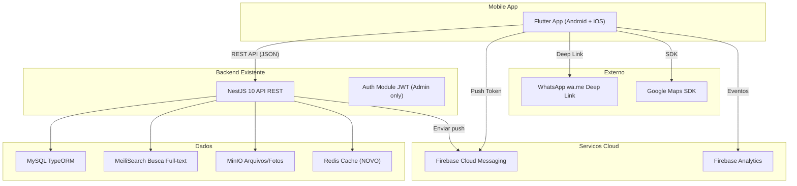
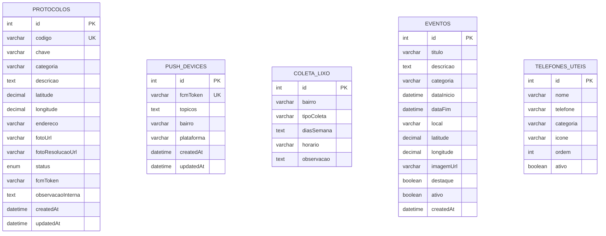
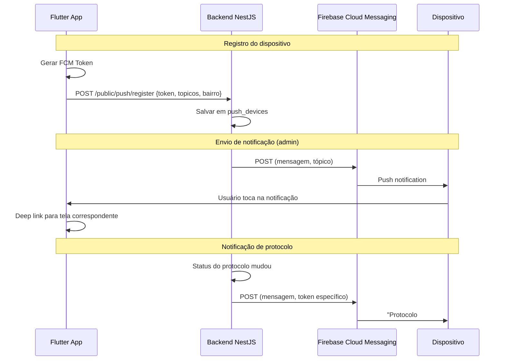
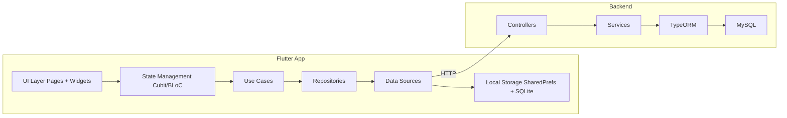
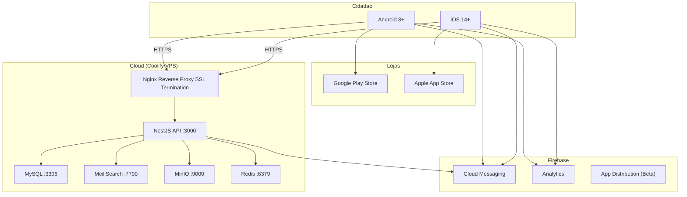

# 🏗️ Volume 3 — Arquitetura Técnica

## Projeto "Prefeitura no Bolso"

| Item | Detalhe |
|------|---------|
| **App** | Flutter (Android + iOS) |
| **Backend** | NestJS 10 (backend existente em `prefeitura-brazopolis-backend`) |
| **Banco de dados** | MySQL (via TypeORM v0.3.20, já existente) |
| **Busca** | MeiliSearch v0.37 (já existente) |
| **Armazenamento** | MinIO v8 (já existente) |
| **Notificações** | Firebase Cloud Messaging (FCM) |
| **Cache** | Redis (novo) |
| **Mapas** | Google Maps SDK / OpenStreetMap |

---

## Sumário

1. [Visão Geral da Arquitetura](#1-visão-geral-da-arquitetura)
2. [Diagrama de Arquitetura Geral](#2-diagrama-de-arquitetura-geral)
3. [App Flutter — Clean Architecture](#3-app-flutter--clean-architecture)
4. [Backend NestJS — Extensão do Existente](#4-backend-nestjs--extensão-do-existente)
5. [Banco de Dados](#5-banco-de-dados)
6. [Firebase e Notificações Push](#6-firebase-e-notificações-push)
7. [Cache e Offline](#7-cache-e-offline)
8. [Integrações Externas](#8-integrações-externas)
9. [Segurança](#9-segurança)
10. [Infraestrutura e Deploy](#10-infraestrutura-e-deploy)
11. [Diagrama de Componentes](#11-diagrama-de-componentes)
12. [Diagrama de Implantação](#12-diagrama-de-implantação)

---

## 1. Visão Geral da Arquitetura

### 1.1 Princípio: Reutilizar ao Máximo

O backend da prefeitura **já existe e já possui dezenas de módulos**. O app Flutter **não deve recriar APIs** — ele deve **consumir as APIs públicas existentes** e adicionar endpoints apenas para funcionalidades exclusivas do mobile.

### 1.2 O que já existe vs. O que precisa ser criado

| Componente | Status | Ação |
|------------|--------|------|
| API de Notícias | ✅ Existe | Consumir diretamente |
| API de Concursos | ✅ Existe | Consumir diretamente |
| API de Cultura/Turismo | ✅ Existe | Consumir diretamente |
| API de Educação | ✅ Existe | Consumir diretamente |
| API de Galeria | ✅ Existe | Consumir diretamente |
| API de Licitações | ✅ Existe | Consumir diretamente |
| API de Obras | ✅ Existe | Consumir diretamente |
| API de Vacinação | ✅ Existe | Consumir diretamente |
| API de Secretarias | ✅ Existe | Consumir diretamente |
| API de Saúde | ✅ Existe | Consumir diretamente |
| API de Carousel | ✅ Existe | Consumir para hero da Home |
| API de Busca (MeiliSearch) | ✅ Existe | Consumir para busca global |
| API de Contas Públicas | ✅ Existe | Consumir diretamente |
| API de Assistência Social | ✅ Existe | Consumir diretamente |
| **Módulo de Protocolos** | 🆕 Novo | Criar no backend |
| **Módulo de Notificações Push** | 🆕 Novo | Criar no backend + FCM |
| **Módulo de Coleta de Lixo** | 🆕 Novo | Criar no backend |
| **Módulo de Eventos/Agenda** | 🆕 Novo | Criar ou estender notícias |
| **Módulo de IPTU (app)** | 🔧 Adaptar | Wrapper para o sistema de IPTU existente |
| **Módulo de Emergência** | 📱 App only | Sem backend (dados estáticos) |

---

## 2. Diagrama de Arquitetura Geral



---

## 3. App Flutter — Clean Architecture

### 3.1 Camadas

```
┌──────────────────────────────────────────────┐
│                PRESENTATION                   │
│  (Widgets, Pages, BLoC/Cubit)                │
├──────────────────────────────────────────────┤
│                  DOMAIN                       │
│  (Entities, UseCases, Repository interfaces) │
├──────────────────────────────────────────────┤
│                   DATA                        │
│  (Repository impl, DataSources, Models)      │
├──────────────────────────────────────────────┤
│                 CORE / SHARED                 │
│  (DI, Config, Utils, Theme, Constants)       │
└──────────────────────────────────────────────┘
```

### 3.2 Estrutura de Pastas

```
lib/
├── main.dart
├── app.dart                          # MaterialApp, rotas, tema
├── core/
│   ├── config/
│   │   ├── app_config.dart           # URLs base, feature flags
│   │   └── environment.dart          # dev/staging/prod
│   ├── constants/
│   │   ├── app_colors.dart           # Paleta de cores (#004A80, etc.)
│   │   ├── app_typography.dart       # Estilos de texto
│   │   ├── app_spacing.dart          # Espaçamentos (4, 8, 16, 24...)
│   │   └── api_endpoints.dart        # Rotas da API
│   ├── di/
│   │   └── injection_container.dart  # GetIt / Injectable
│   ├── error/
│   │   ├── failures.dart             # Failure classes
│   │   └── exceptions.dart           # Exception classes
│   ├── network/
│   │   ├── api_client.dart           # Dio + interceptors
│   │   ├── network_info.dart         # Connectivity check
│   │   └── api_interceptor.dart      # Log, cache, retry
│   ├── storage/
│   │   ├── local_storage.dart        # SharedPreferences wrapper
│   │   └── cache_manager.dart        # Cache com TTL
│   ├── theme/
│   │   ├── app_theme.dart            # ThemeData completo
│   │   └── app_theme_extensions.dart # Extensões de tema
│   └── utils/
│       ├── date_utils.dart
│       ├── url_launcher_utils.dart   # WhatsApp, telefone, maps
│       └── image_utils.dart          # Compressão de foto
│
├── features/
│   ├── home/
│   │   ├── presentation/
│   │   │   ├── pages/
│   │   │   │   └── home_page.dart
│   │   │   ├── widgets/
│   │   │   │   ├── search_bar_widget.dart
│   │   │   │   ├── hero_carousel.dart
│   │   │   │   ├── alert_cards.dart
│   │   │   │   ├── service_grid.dart
│   │   │   │   └── events_widget.dart
│   │   │   └── cubit/
│   │   │       ├── home_cubit.dart
│   │   │       └── home_state.dart
│   │   ├── domain/
│   │   │   ├── entities/
│   │   │   │   ├── alert.dart
│   │   │   │   └── service_item.dart
│   │   │   ├── usecases/
│   │   │   │   └── get_home_data.dart
│   │   │   └── repositories/
│   │   │       └── home_repository.dart
│   │   └── data/
│   │       ├── models/
│   │       │   ├── alert_model.dart
│   │       │   └── service_item_model.dart
│   │       ├── datasources/
│   │       │   ├── home_remote_datasource.dart
│   │       │   └── home_local_datasource.dart
│   │       └── repositories/
│   │           └── home_repository_impl.dart
│   │
│   ├── protocols/
│   │   ├── presentation/
│   │   │   ├── pages/
│   │   │   │   ├── protocol_categories_page.dart
│   │   │   │   ├── create_protocol_page.dart
│   │   │   │   ├── protocol_detail_page.dart
│   │   │   │   ├── my_protocols_page.dart
│   │   │   │   └── search_protocol_page.dart
│   │   │   ├── widgets/
│   │   │   │   ├── category_card.dart
│   │   │   │   ├── photo_capture.dart
│   │   │   │   ├── gps_confirm.dart
│   │   │   │   ├── protocol_timeline.dart
│   │   │   │   └── protocol_confirmation.dart
│   │   │   └── cubit/
│   │   │       ├── create_protocol_cubit.dart
│   │   │       ├── protocol_detail_cubit.dart
│   │   │       └── my_protocols_cubit.dart
│   │   ├── domain/
│   │   │   ├── entities/
│   │   │   │   ├── protocol.dart
│   │   │   │   ├── protocol_category.dart
│   │   │   │   └── protocol_status.dart
│   │   │   ├── usecases/
│   │   │   │   ├── create_protocol.dart
│   │   │   │   ├── get_protocol_status.dart
│   │   │   │   └── get_local_protocols.dart
│   │   │   └── repositories/
│   │   │       └── protocol_repository.dart
│   │   └── data/
│   │       ├── models/
│   │       ├── datasources/
│   │       └── repositories/
│   │
│   ├── health/                       # Mesmo padrão
│   ├── education/
│   ├── tourism/
│   ├── iptu/
│   ├── events/
│   ├── garbage_collection/
│   ├── emergency/
│   ├── civil_defense/
│   ├── contests/
│   ├── public_works/
│   ├── certificates/
│   ├── bids/                         # Licitações
│   ├── transparency/
│   ├── notifications/
│   ├── map/
│   ├── settings/
│   └── onboarding/
│
├── shared/
│   ├── widgets/
│   │   ├── app_scaffold.dart         # Scaffold padrão com bottom nav
│   │   ├── app_card.dart             # Card estilo site
│   │   ├── app_button.dart           # Botões padronizados
│   │   ├── app_header.dart           # AppBar padronizada
│   │   ├── loading_widget.dart
│   │   ├── error_widget.dart
│   │   ├── empty_state_widget.dart
│   │   ├── offline_banner.dart
│   │   └── emergency_fab.dart        # FAB de emergência
│   └── navigation/
│       ├── app_router.dart           # GoRouter
│       └── routes.dart               # Constantes de rotas
│
└── l10n/
    ├── app_pt.arb                    # Português
    ├── app_en.arb                    # Inglês
    └── app_es.arb                    # Espanhol
```

### 3.3 Gerenciamento de Estado

| Decisão | Escolha | Justificativa |
|---------|---------|---------------|
| State Management | **flutter_bloc (Cubit)** | Simples, testável, separação clara |
| Injeção de Dependência | **get_it + injectable** | Padrão da comunidade, autogeração |
| Navegação | **go_router** | Deep links, declarativo |
| HTTP Client | **dio** | Interceptors, cancelamento, retry |
| Cache local | **shared_preferences** (simples) + **sqflite** (protocolos) | Dados leves + persistência estruturada |
| Imagens | **cached_network_image** | Cache automático de imagens |
| Mapas | **google_maps_flutter** | Padrão Google |
| Câmera | **image_picker** | Simples, cross-platform |
| GPS | **geolocator** | Localização precisa |
| Push | **firebase_messaging** | FCM |
| Analytics | **firebase_analytics** | Tracking anônimo |
| Internacionalização | **flutter_localizations** + **intl** | l10n nativo |

---

## 4. Backend NestJS — Extensão do Existente

### 4.1 Novos módulos a criar

```
src/modules/
├── admin/
│   ├── ... (módulos existentes)
│   ├── protocolo/                    # 🆕 CRUD de protocolos (admin)
│   │   ├── protocolo.controller.ts
│   │   ├── protocolo.service.ts
│   │   ├── protocolo.module.ts
│   │   └── dto/
│   │       ├── create-protocolo.dto.ts
│   │       └── update-protocolo-status.dto.ts
│   ├── coleta-lixo/                  # 🆕 Horários de coleta (admin)
│   │   ├── coleta-lixo.controller.ts
│   │   ├── coleta-lixo.service.ts
│   │   └── coleta-lixo.module.ts
│   ├── push-notification/            # 🆕 Envio de push (admin)
│   │   ├── push-notification.controller.ts
│   │   ├── push-notification.service.ts
│   │   └── push-notification.module.ts
│   └── evento/                       # 🆕 Agenda da cidade (admin)
│       ├── evento.controller.ts
│       ├── evento.service.ts
│       └── evento.module.ts
│
├── public/
│   ├── ... (módulos existentes)
│   ├── protocolo/                    # 🆕 Criar + consultar (público/anônimo)
│   ├── coleta-lixo/                  # 🆕 Consulta por bairro (público)
│   ├── push-notification/            # 🆕 Registrar token FCM (público)
│   ├── evento/                       # 🆕 Listar eventos (público)
│   └── emergencia/                   # 🆕 Telefones úteis (público)
```

### 4.2 Novas Entidades (TypeORM)

#### Protocolo

```typescript
@Entity('protocolos')
export class Protocolo {
  @PrimaryGeneratedColumn()
  id: number;

  @Column({ length: 10, unique: true })
  codigo: string;            // Ex: "5730"

  @Column({ length: 10 })
  chave: string;             // Ex: "FT42B"

  @Column({ length: 50 })
  categoria: string;         // Ex: "buraco", "poste_apagado"

  @Column({ type: 'text', nullable: true })
  descricao: string;

  @Column({ type: 'decimal', precision: 10, scale: 7 })
  latitude: number;

  @Column({ type: 'decimal', precision: 10, scale: 7 })
  longitude: number;

  @Column({ length: 255 })
  endereco: string;          // Geocoding reverso

  @Column({ length: 500 })
  fotoUrl: string;           // URL no MinIO

  @Column({ length: 500, nullable: true })
  fotoResolucaoUrl: string;  // Foto do reparo

  @Column({
    type: 'enum',
    enum: ['recebido', 'em_analise', 'equipe_enviada', 'concluido', 'cancelado'],
    default: 'recebido'
  })
  status: string;

  @Column({ length: 500, nullable: true })
  fcmToken: string;          // Token para notificação (pseudonimizado)

  @Column({ type: 'text', nullable: true })
  observacaoInterna: string; // Visível apenas no admin

  @CreateDateColumn()
  createdAt: Date;

  @UpdateDateColumn()
  updatedAt: Date;
}
```

#### PushDevice

```typescript
@Entity('push_devices')
export class PushDevice {
  @PrimaryGeneratedColumn()
  id: number;

  @Column({ length: 500, unique: true })
  fcmToken: string;

  @Column({ type: 'simple-array', nullable: true })
  topicos: string[];        // ["municipio", "saude", "centro"]

  @Column({ length: 50, nullable: true })
  bairro: string;

  @Column({ length: 10, nullable: true })
  plataforma: string;       // "android" | "ios"

  @CreateDateColumn()
  createdAt: Date;

  @UpdateDateColumn()
  updatedAt: Date;
}
```

#### ColetaLixo

```typescript
@Entity('coleta_lixo')
export class ColetaLixo {
  @PrimaryGeneratedColumn()
  id: number;

  @Column({ length: 100 })
  bairro: string;

  @Column({ length: 50 })
  tipoColeta: string;       // "comum" | "reciclavel" | "volumosos"

  @Column({ type: 'simple-array' })
  diasSemana: string[];     // ["segunda", "quarta", "sexta"]

  @Column({ length: 20, nullable: true })
  horario: string;           // "7h às 12h"

  @Column({ type: 'text', nullable: true })
  observacao: string;
}
```

#### Evento

```typescript
@Entity('eventos')
export class Evento {
  @PrimaryGeneratedColumn()
  id: number;

  @Column({ length: 200 })
  titulo: string;

  @Column({ type: 'text' })
  descricao: string;

  @Column({ length: 50 })
  categoria: string;         // "cultura", "esporte", "saude"

  @Column({ type: 'datetime' })
  dataInicio: Date;

  @Column({ type: 'datetime', nullable: true })
  dataFim: Date;

  @Column({ length: 200 })
  local: string;

  @Column({ type: 'decimal', precision: 10, scale: 7, nullable: true })
  latitude: number;

  @Column({ type: 'decimal', precision: 10, scale: 7, nullable: true })
  longitude: number;

  @Column({ length: 500, nullable: true })
  imagemUrl: string;

  @Column({ default: false })
  destaque: boolean;

  @Column({ default: true })
  ativo: boolean;

  @CreateDateColumn()
  createdAt: Date;
}
```

---

## 5. Banco de Dados

### 5.1 Diagrama ER (Novas tabelas)



### 5.2 Tabelas existentes reutilizadas

O banco MySQL existente já possui tabelas para: notícias, concursos, cultura/turismo, educação, galeria, licitações, obras, vacinação, secretarias, saúde, carousel, contas públicas, assistência social, usuários admin, permissões, logs.

**Não é necessário recriar nenhuma dessas tabelas.**

---

## 6. Firebase e Notificações Push

### 6.1 Arquitetura de Push



### 6.2 Tópicos FCM

| Tópico | Inscrição | Conteúdo |
|--------|-----------|----------|
| `municipio` | Automática (todos) | Avisos gerais |
| `saude` | Configurável | Campanhas, vacinação |
| `educacao` | Configurável | Calendário, comunicados |
| `iptu` | Configurável | Prazos de IPTU |
| `defesa_civil` | Automática (obrigatória) | Alertas de emergência |
| `licitacoes` | Configurável | Novos editais |
| `concursos` | Configurável | Novos concursos |
| `eventos` | Configurável | Eventos em destaque |
| `bairro_{nome}` | Configurável | Notificações por bairro |

---

## 7. Cache e Offline

### 7.1 Estratégia de Cache

| Dado | Cache | TTL | Storage |
|------|-------|-----|---------|
| Carousel/banners | ✅ | 1h | Memória + disco |
| Notícias | ✅ | 30min | Disco |
| UBS / Escolas | ✅ | 24h | Disco |
| Pontos turísticos | ✅ | 7 dias | Disco |
| Coleta de lixo | ✅ | 7 dias | SharedPreferences |
| Telefones de emergência | ✅ | 30 dias | SharedPreferences |
| Protocolos salvos | ✅ | Permanente | SQLite |
| Configurações | ✅ | Permanente | SharedPreferences |
| IPTU (consulta) | ❌ | - | Apenas online |
| Imagens | ✅ | 7 dias | Cache de imagens (disco) |

### 7.2 Redis (Backend)

```
Cache de respostas da API:
  - GET /public/noticias → cache 5min
  - GET /public/carousel → cache 10min
  - GET /public/vacinacao → cache 1h
  - GET /public/cultura-turismo → cache 6h
  - GET /public/coleta-lixo/{bairro} → cache 24h

Rate limiting:
  - 100 requests/minuto por IP
  - 10 protocolos/hora por IP (anti-spam)
```

---

## 8. Integrações Externas

| Serviço | Integração | Tipo |
|---------|-----------|------|
| WhatsApp | Deep link `wa.me/{numero}?text={mensagem}` | URL Scheme |
| Google Maps | SDK nativo (Flutter plugin) | SDK |
| Firebase Cloud Messaging | SDK + REST Admin API | SDK + REST |
| Firebase Analytics | SDK | SDK |
| MinIO | REST API (upload de fotos de protocolos) | REST |
| MeiliSearch | REST API (busca global) | REST |

---

## 9. Segurança

### 9.1 Sem Autenticação de Usuário

O app **não possui login**. Porém, a comunicação com a API é protegida:

| Medida | Implementação |
|--------|--------------|
| HTTPS obrigatório | TLS 1.3, certificados válidos |
| API Key do app | Header `X-App-Key` em todas as requests (identifica o app, não o usuário) |
| Rate limiting | 100 req/min por IP, 10 protocolos/hora por IP |
| Validação de input | Class-validator no NestJS, sanitização |
| Upload seguro | Validação de tipo MIME (apenas imagens), tamanho máx 5MB |
| CORS | Apenas domínios autorizados |
| Helmet | Headers de segurança |
| Throttle | @nestjs/throttler |

### 9.2 Proteção de dados

| Dado | Proteção |
|------|----------|
| FCM Token | Pseudonimizado, não vinculado a identidade |
| Fotos de protocolo | Armazenadas no MinIO, acesso via URL assinada |
| GPS do protocolo | Usado apenas para localizar o problema |
| Chave do protocolo | Hash bcrypt (servidor não armazena em texto puro) |

---

## 10. Infraestrutura e Deploy

### 10.1 Ambiente atual (Coolify/Docker)

O backend já roda em Docker via Coolify. O app Flutter não precisa de infra própria (é distribuído via lojas).

```
Docker Compose (existente + novos serviços):
├── nestjs-api        (porta 3000)
├── mysql             (porta 3306)
├── meilisearch       (porta 7700)
├── minio             (porta 9000)
├── redis             (porta 6379)  ← NOVO
└── nginx             (porta 80/443)
```

### 10.2 Deploy do App

| Plataforma | Ferramenta |
|-----------|-----------|
| Android | Play Store (via Google Play Console) |
| iOS | App Store (via App Store Connect) |
| CI/CD | GitHub Actions ou Codemagic |
| Versionamento | Semantic Versioning (1.0.0, 1.1.0...) |
| Distribuição beta | Firebase App Distribution |

---

## 11. Diagrama de Componentes



---

## 12. Diagrama de Implantação



---

> **Nota:** Este volume detalha a arquitetura técnica referenciando diretamente o backend existente em `prefeitura-brazopolis-backend`. Os diagramas UML detalhados (sequência, classes, casos de uso) estão no Volume 4.
