# 📐 Volume 4 — Diagramas UML e Fluxos

## Projeto "Prefeitura de Brazópolis"

---

## Sumário

1. [Diagramas de Caso de Uso](#1-diagramas-de-caso-de-uso)
2. [Diagramas de Sequência](#2-diagramas-de-sequência)
3. [Diagrama de Classes (Domain)](#3-diagrama-de-classes-domain)
4. [Diagramas de Estado](#4-diagramas-de-estado)
5. [Diagramas de Atividade](#5-diagramas-de-atividade)

---

## 1. Diagramas de Caso de Uso

### 1.1 Caso de Uso Geral

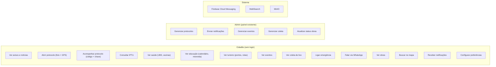

### 1.2 Detalhamento: Protocolo

| # | Caso de Uso | Ator | Pré-condição | Fluxo principal |
|---|-------------|------|-------------|-----------------|
| UC-01 | Abrir protocolo | Cidadão | Nenhuma | Selecionar categoria → Tirar foto → Confirmar GPS → Descrição → Enviar |
| UC-02 | Acompanhar protocolo | Cidadão | Código + chave | Informar código → Validar chave → Ver timeline |
| UC-03 | Receber atualização | Cidadão | Token FCM salvo | Push automático ao mudar status |
| UC-04 | Gerenciar protocolo | Admin | Autenticado (JWT) | Ver lista → Alterar status → Observação → Salvar |

### 1.3 Detalhamento: IPTU

| # | Caso de Uso | Ator | Pré-condição | Fluxo principal |
|---|-------------|------|-------------|-----------------|
| UC-05 | Consultar débitos | Cidadão | Inscrição imobiliária | Informar inscrição → Ver parcelas → Status |
| UC-06 | Gerar boleto | Cidadão | Parcela pendente | Selecionar parcela → Gerar PDF → Download |
| UC-07 | Pagar via PIX | Cidadão | Parcela pendente | Selecionar parcela → QR Code → Copia-e-cola |
| UC-08 | Salvar favorito | Cidadão | Nenhuma | Estrela → Salvar inscrição localmente |

### 1.4 Detalhamento: Notificações

| # | Caso de Uso | Ator | Pré-condição | Fluxo principal |
|---|-------------|------|-------------|-----------------|
| UC-09 | Registrar dispositivo | Sistema | App instalado | Gerar token → Enviar ao backend → Salvar |
| UC-10 | Configurar tópicos | Cidadão | Token registrado | Toggles on/off → Atualizar tópicos |
| UC-11 | Enviar push | Admin | Autenticado | Compor mensagem → Selecionar tópico → Enviar via FCM |
| UC-12 | Receber push | Cidadão | Token válido | Notificação → Toque → Deep link para tela |

---

## 2. Diagramas de Sequência

### 2.1 Abrir Protocolo

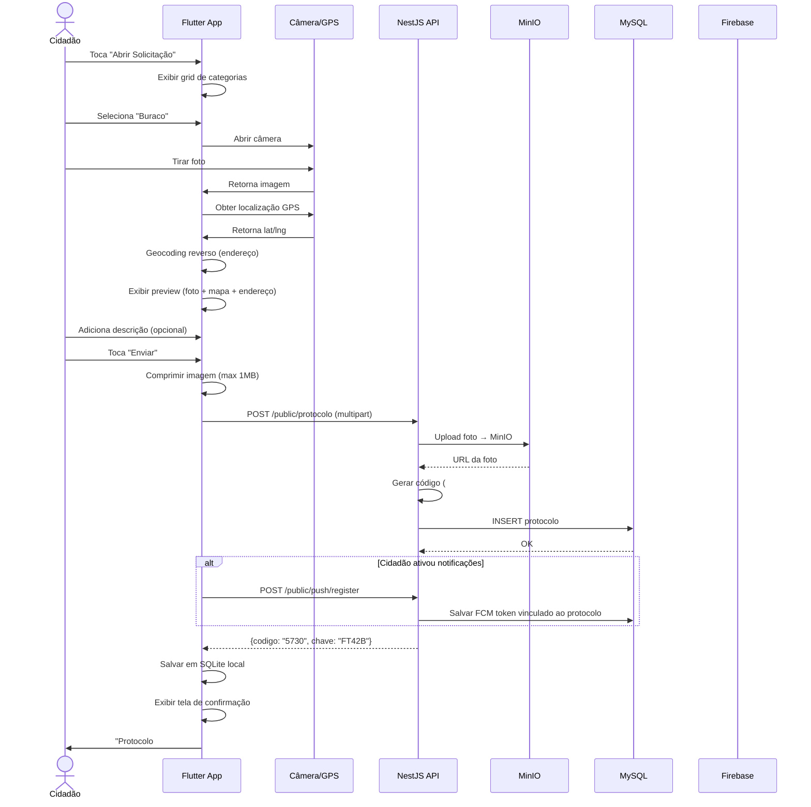

### 2.2 Acompanhar Protocolo

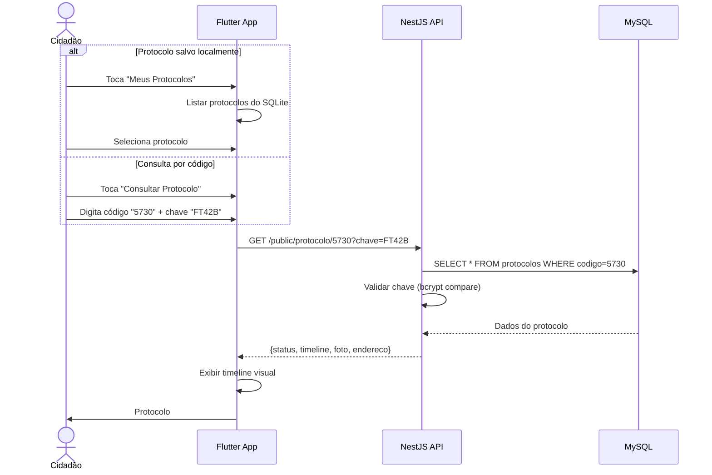

### 2.3 Consultar IPTU

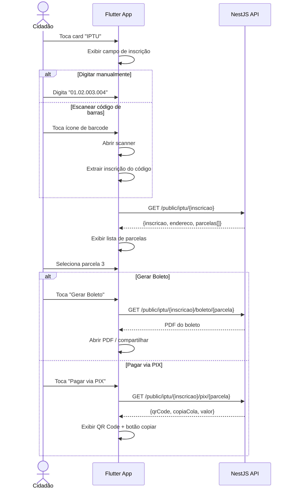

### 2.4 Receber Notificação Push

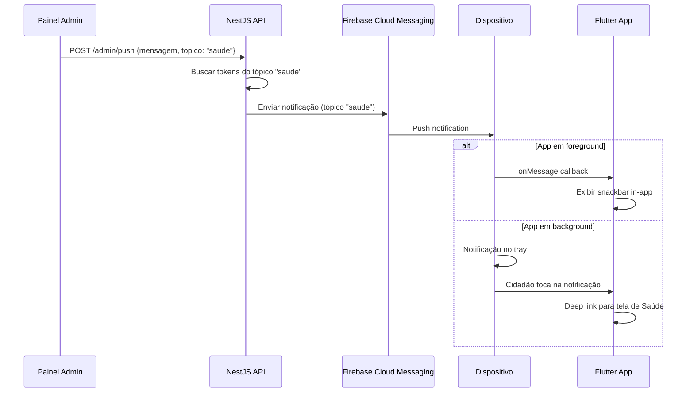

### 2.5 Busca Global (MeiliSearch)

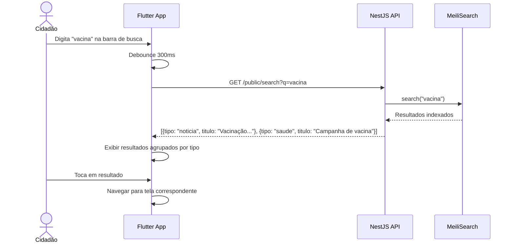

---

## 3. Diagrama de Classes (Domain)

### 3.1 Entidades do Domínio

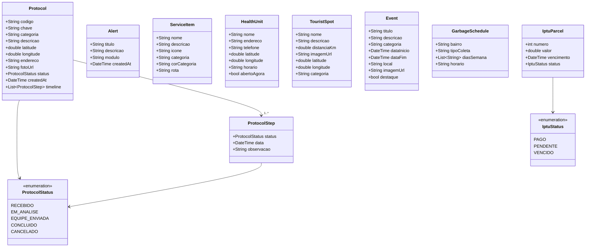

---

## 4. Diagramas de Estado

### 4.1 Ciclo de Vida do Protocolo

```mermaid
stateDiagram-v2
    [*] --> Recebido: Cidadão envia
    Recebido --> EmAnalise: Admin abre
    EmAnalise --> EquipeEnviada: Admin despacha
    EquipeEnviada --> Concluido: Equipe resolve
    EmAnalise --> Cancelado: Admin cancela
    Recebido --> Cancelado: Spam / inválido

    Recebido: 📩 Protocolo criado
    EmAnalise: 🔍 Em análise pela secretaria
    EquipeEnviada: 🚚 Equipe no local
    Concluido: ✅ Problema resolvido
    Cancelado: ❌ Cancelado / inválido

    note right of Recebido: Push: "Protocolo recebido"
    note right of EmAnalise: Push: "Em análise"
    note right of EquipeEnviada: Push: "Equipe enviada"
    note right of Concluido: Push: "Resolvido! Avalie"
```

### 4.2 Ciclo de Navegação do App

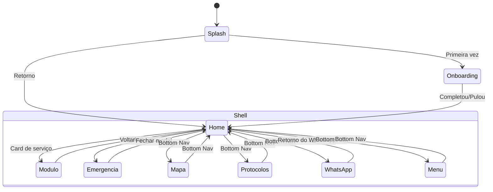

---

## 5. Diagramas de Atividade

### 5.1 Fluxo de Abertura do App

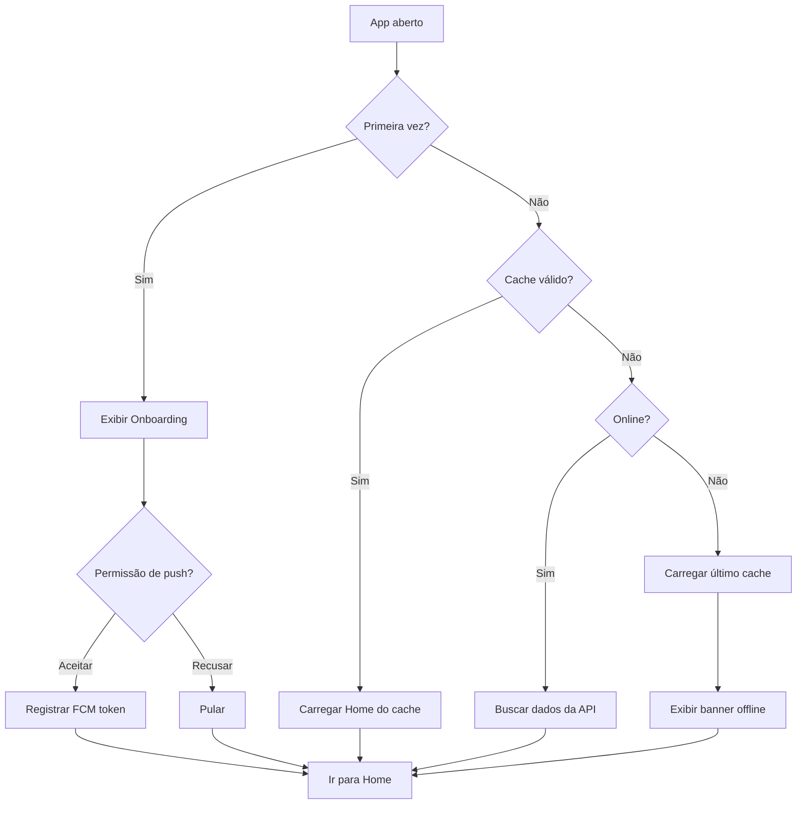

### 5.2 Fluxo de Abertura de Protocolo

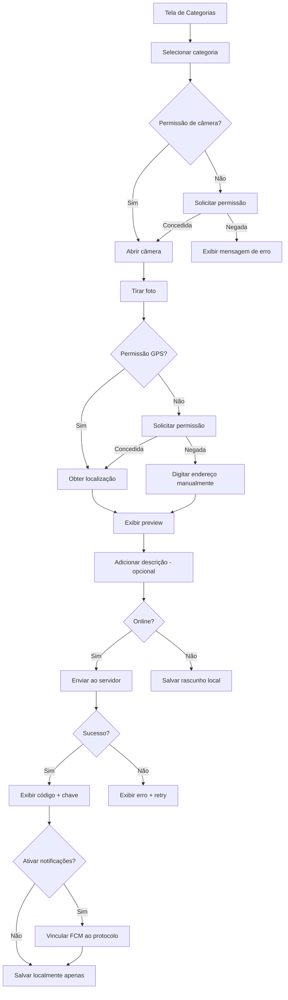

### 5.3 Fluxo de WhatsApp

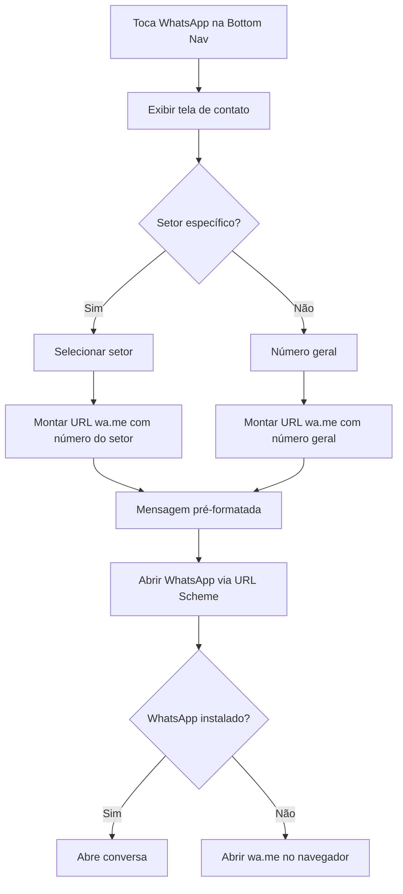

---

> **Nota:** Todos os diagramas usam Mermaid para renderização. Em implementação, os diagramas de sequência servem como guia para criação dos testes de integração.
